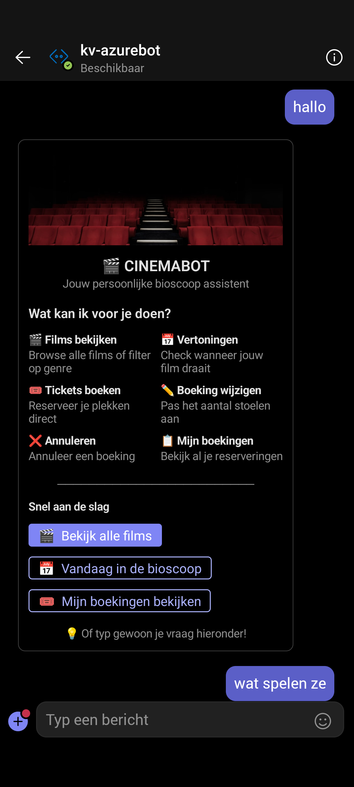
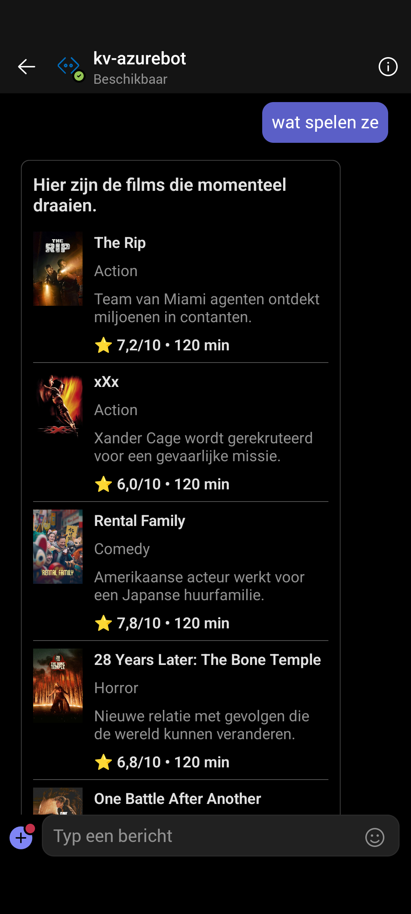
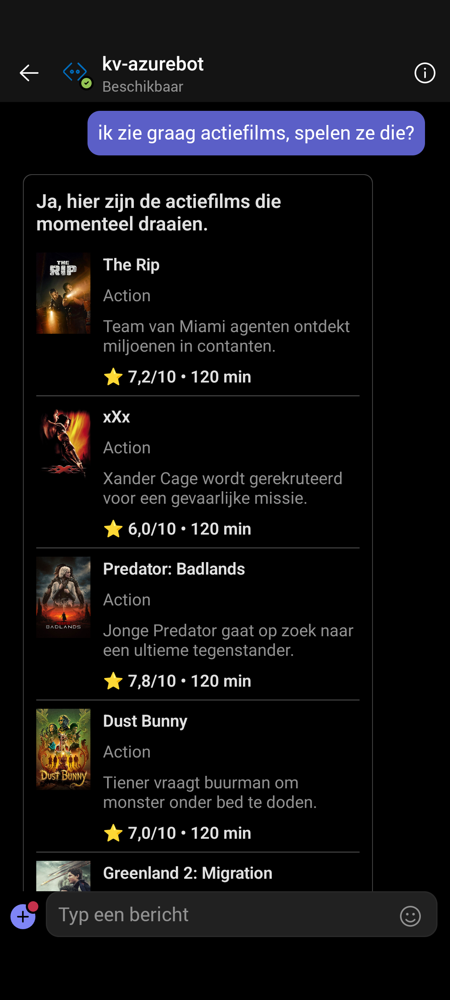
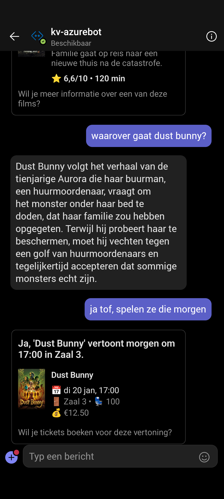
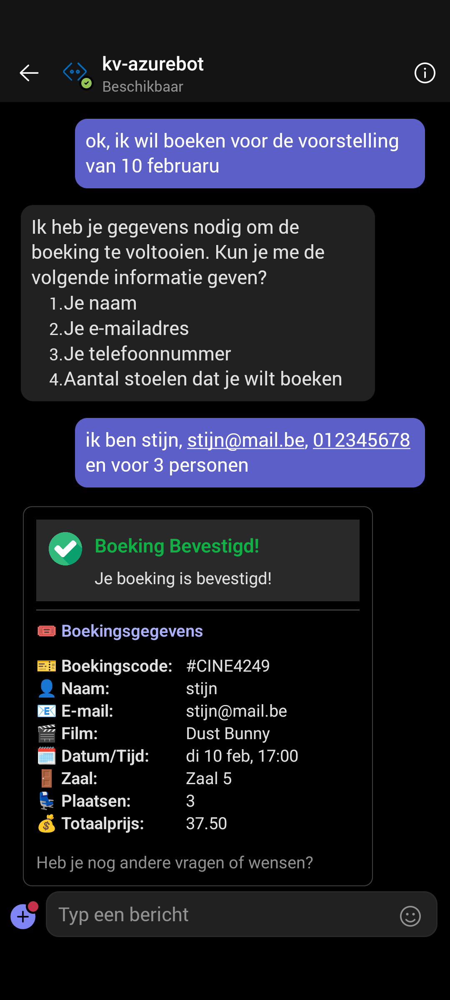
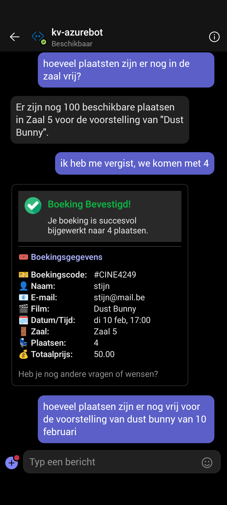

# CinemaBot

Een conversational chatbot voor bioscooptickets boeken via Microsoft Teams, aangedreven door OpenAI en Semantic Kernel.

> Schoolproject voor AI.NET - Thomas More Hogeschool (score: 19/20)

| Welkom + menu | Films overzicht |
|---------------|-----------------|
|  |  |

| Genre filter (actiefilms) | Filmdetail + vertoning |
|---------------------------|------------------------|
|  |  |

| Ticket boeken | Boeking wijzigen |
|---------------|------------------|
|  |  |

## Tech stack

| Laag | Technologie |
|------|-------------|
| AI | OpenAI GPT-4o-mini, Microsoft Semantic Kernel |
| Bot | Bot Framework SDK, Microsoft Teams |
| Backend | ASP.NET Core 8.0 Web API |
| Database | SQLite + Entity Framework Core |
| UI | Adaptive Cards (rich visuals in Teams) |
| Film data | TMDb API (posters, beschrijvingen, ratings) |

## Features

- **Natuurlijke taal** - vraag in gewoon Nederlands naar films, vertoningen en boekingen
- **Films browsen** - overzicht met TMDb posters, genre, rating en beschrijving
- **Genre filter** - "toon actiefilms" filtert intelligent op genre
- **Vertoningen checken** - datum, zaal, beschikbare plaatsen en prijs
- **Tickets boeken** - volledige boekingsflow met bevestigingscode
- **Boeking wijzigen** - aantal stoelen aanpassen met herberekening
- **Boeking annuleren** - annuleer via boekingscode
- **Adaptive Cards** - rijke visuele kaarten met filmposters en boekingsoverzicht
- **Conversational context** - bot onthoudt context binnen het gesprek

## Opstarten

```bash
# Cinema API starten (database + TMDb data)
cd API-solution/Cinema.API
dotnet run                    # http://localhost:5001

# Bot API starten (Semantic Kernel + OpenAI)
cd Bot-solution/Bot.API
dotnet run                    # http://localhost:5000

# Ngrok tunnel voor Teams
ngrok http 5000
```

Configureer API keys in `appsettings.json` (zie `appsettings.Example.json`).

## Projectstructuur

```
CinemaBot/
  API-solution/
    Cinema.API/               REST API voor films, vertoningen, boekingen
      Controllers/            API endpoints
      Data/                   DbContext + TMDb seeding
      Models/                 Movie, Screening, Booking entities
  Bot-solution/
    Bot.API/                  Semantic Kernel chatbot
      Services/               KernelService (OpenAI + plugins)
      Cards/                  AdaptiveCardBuilders (rich UI)
    Bot.Core/                 CinemaPlugin (7 SK functions)
    Bot.TestConsole/          Console test client
```

## Architectuur

- **Semantic Kernel plugins** - 7 functies (films, vertoningen, boekingen, beschikbaarheid, etc.)
- **AdaptiveCardBuilders** - rijke kaarten voor filmlijsten, boekingsbevestiging, wijzigingen
- **TMDb integratie** - actuele filmdata met posters bij database seeding
- **Bot Framework** - Teams integratie via EchoBot + ngrok tunneling
- **Repository pattern** - EF Core met SQLite voor films, vertoningen en boekingen
